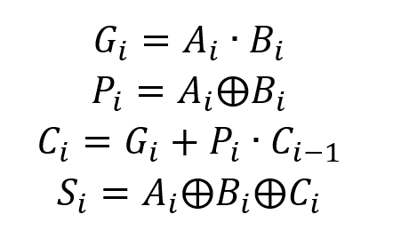
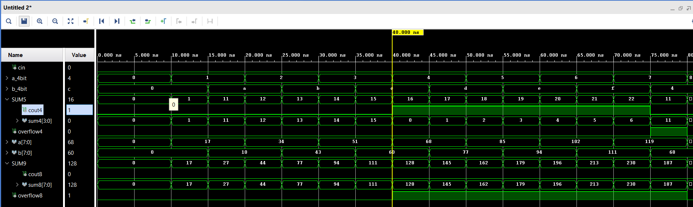
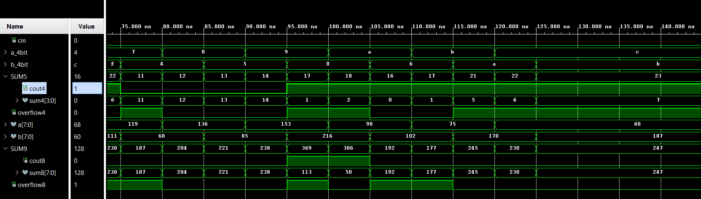
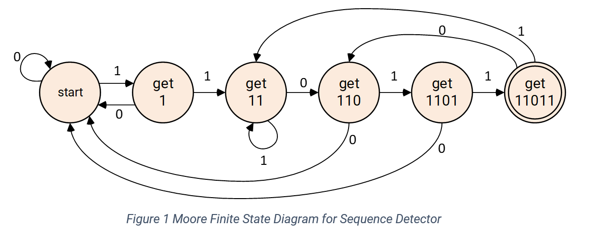
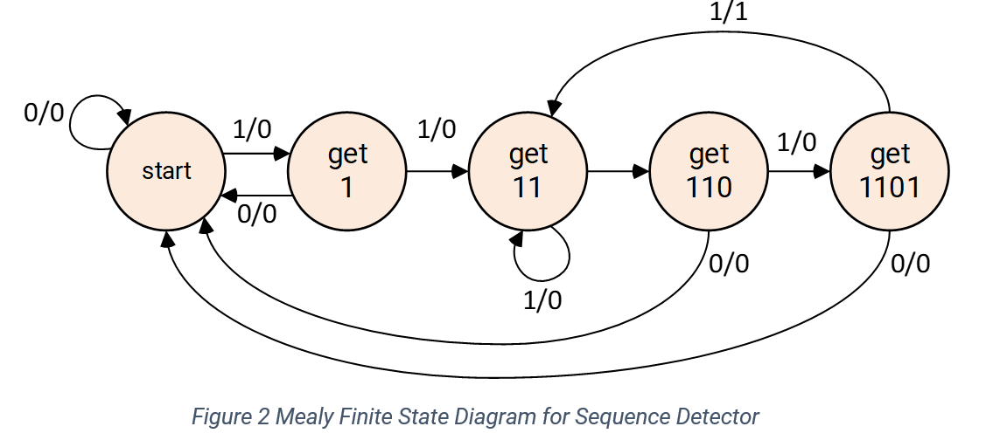
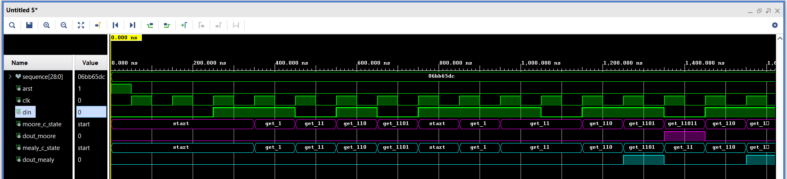
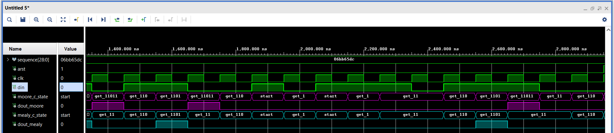

# MSc-Synthesis

> **Homework and Project for Master Course (Synthesis of Digital Systems)**

## Homework 01

### Generic Carry Lookahead Adder

The slow speed of the ripple-carry adder is caused by the long path along which a carry signal must propagate. The total delay along the critical path is 2n + 1. The total delay in the n-bit carry-lookahead adder is four gate delays. The total delay in the n-bit carry-lookahead adder is four gate delays. The carry input at any stage of the adder is independent of the carry bits generated at the independent stages. Output of any stage is dependent only on the bits which are added in the previous stages and the carry input provided at the beginning stage. Hence, the circuit at any stage does not have to wait for the generation of carry-bit from the previous stage and carry bit can be evaluated at any instant of time. The values of all gi and pi signals are determined after one gate delay. It takes two more gate delays to evaluate all carry signals. Finally, it takes one more gate delay (XOR) to generate all sum bits. The key to the good performance of the adder is quick evaluation of carry signals. In CLA adder, the propagation delay is reduced. The carry output at any stage is dependent only on the initial carry bit of the beginning stage.

#### Waveforms

### Sequence Detector

It is required to model a sequence detector that detects the sequence 11011 assuming
overlapping sequence detection.

#### Moore FSM

#### Mealy FSM

#### Waveforms

