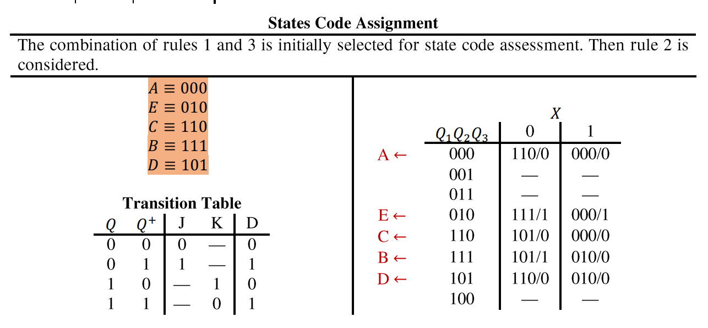

# MSc-Synthesis

> **Homework and Project for Master Course (Synthesis of Digital Systems)**

## Homework 02

### States Reduction of FSM

**Given is Machine M:**

- a) Find the minimal machine (in the number of states) that is equivalent to machine M
- b) Draw the triangular table of machine M
- c) Solve the triangular table
- d) Find the maximal compatible groups of states.
- e) Solve graphically the covering/closure problem.
- f) Formulate algebraically the binate covering problem.
- g) Realize the machine using JK flipflops and combinational gates.

  

### Solutions

  

  

  

  

  

  

  

  

  

